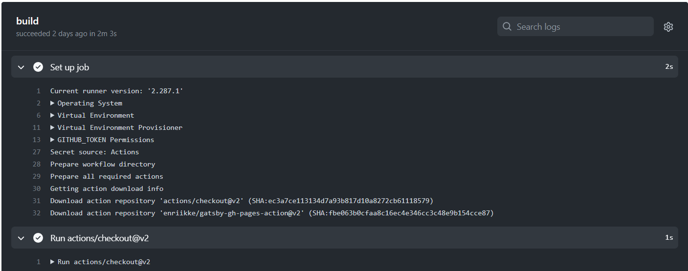

I didn't find an article on the internet that covers the process thoroughly. So I want to share how I did this with my blog.

This post covers how to set up continuous deployment of Gatsby blog to Github Pages using Github Actions. It is applicable to any Gatsby project. I am going to use a blog as an example since it is probably the most common use of it. And let's start right away. 

First, if you don't have a project ready to publish, use [Gatsby's blog starter](https://github.com/gatsbyjs/gatsby-starter-blog) as a template. You can follow instructions in its `README.md` file. 

Then, create directories `.github` in the root of the project and `workflows` inside. Inside of the `workflows` folder, create file `main.yml`. This structure will allow *Github Actions* to detect workflows automatically. Now your project structure should looks similar to this:

```
.
├── .git
├── .github
│   └── workflows
│       └── main.yml
├── .gitignore
├── .prettierignore
├── .prettierrc
├── LICENSE
├── README.md
├── content
├── gatsby-browser.js
├── gatsby-config.js
├── gatsby-node.js
├── package-lock.json
├── package.json
├── src
├── node_modules
└── static
```

The next step is to create a branch to serve as a source for *Github Pages*. You can choose any name, but *Github Pages* by default is looking `gh-pages` branch. 

Now we can fill our `main.yml` file. For this, we'll be using Github Action called [Gatsby Publish](https://github.com/marketplace/actions/gatsby-publish) with several changes. 

Just copy and paste it into our `main.yml` file. Now *Github Actions* uses version 2, so change it to `uses: actions/checkout@v2`. Then, add `deploy-branch: gh-pages` in the end. This will tell the action what is the Github Pages source branch. Also, depending on the branch you are working in, change `dev` to it. It should be `master` if you used starter as a template. 

We need to set up an access token for `access-token: ${{ secrets.ACCESS_TOKEN }}` line. However, first, let's finish with the project directory. For now, your `main.yml` file looks like this:

```yml
name: Gatsby Publish

on:
  push:
    branches:
      - master

jobs:
  build:
    runs-on: ubuntu-latest
    steps:
      - uses: actions/checkout@v2
      - uses: enriikke/gatsby-gh-pages-action@v2
        with:
          access-token: ${{ secrets.ACCESS_TOKEN }}
          deploy-branch: gh-pages
```

If you are publishing your project to the root, meaning *username.github.io*, then you can skip everything related to path prefix. 

You need to tell *Gatsby* and *Github Pages* that links should be relative to your path. For this, add path prefix into `gatsby-config.js` so that it looks like this:

```js
module.exports = {
  ...
  pathPrefix: `/blog`,
  ...
}

```

Replace `/blog` with the name of your project. You can read more about this [here](https://www.gatsbyjs.com/docs/how-to/previews-deploys-hosting/path-prefix/). 

Then add the environmental variable `PREFIX_PATHS: true` into your yml file. So now it should look similar to this:

```yml
name: Gatsby Publish

on:
  push:
    branches:
      - master

jobs:
  build:
    runs-on: ubuntu-latest
    env:
      PREFIX_PATHS: true
    steps:
      - uses: actions/checkout@v2
      - uses: enriikke/gatsby-gh-pages-action@v2
        with:
          access-token: ${{ secrets.ACCESS_TOKEN }}
          deploy-branch: gh-pages
```

Almost there. It is time to set up *access token*. In Github, go to Settings -> Developer settings -> Personal access tokens, and click on *Generate new token*. Give it access to ***repo***, ***workflow*** and ***write:packages*** and set expiration time to ***No expiration***. Click generate token and copy it. 

Now go to your project repository's settings and find *Actions* under the *Secrets* section. Click on *New repository secret*. Name it `ACCESS_TOKEN` and paste generated token into the value field.

Finally, you can push your project to Github, and *voila* everything works. You can see how the project is deployed in the *Actions* section in your repository.
